# Pedigree Examples Gallery

This document showcases all 21 standardized pedigree scenarios demonstrating compliance with the Bennett 2008/2022 NSGC standards.

All examples are automatically generated from `examples/generate-all-scenarios.ts` in CI/CD to ensure consistency with the rendering engine.

---

## 1. Gender Diversity (Bennett 2022)

Modern gender identity markers following the 2022 NSGC updates.

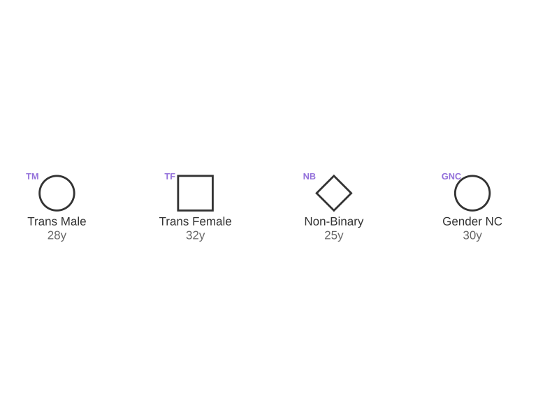

**Features:**
- Trans Male (TM) - assigned female at birth
- Trans Female (TF) - assigned male at birth
- Non-Binary (NB)
- Gender Non-Conforming (GNC)

---

## 2. Generation Numbering

Generational hierarchy with Roman numeral labels.

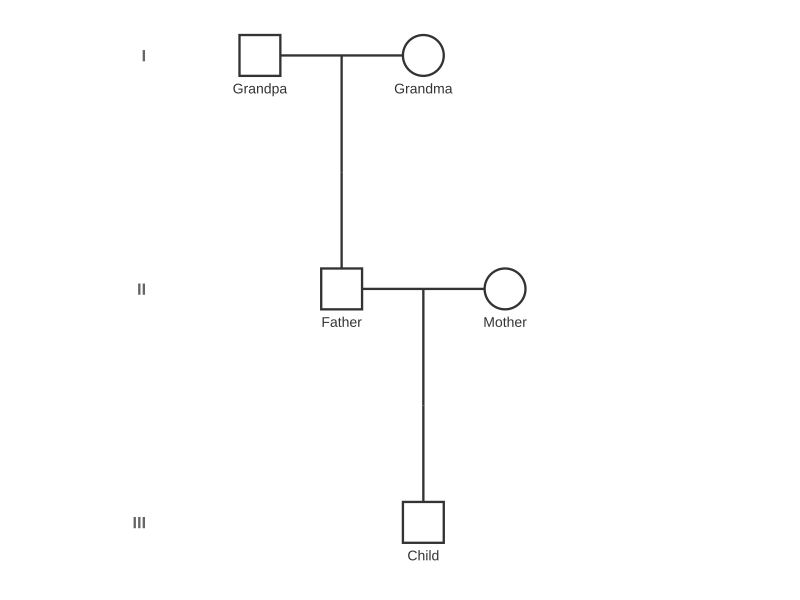

**Features:**
- Generation labels (I, II, III)
- Three-generation pedigree
- Proper vertical spacing

---

## 3. ART Indicators

Assisted Reproductive Technology donor types.

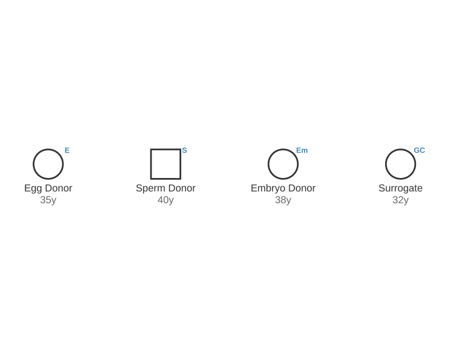

**Features:**
- Egg Donor (ED)
- Sperm Donor (SD)
- Embryo Donor
- Surrogate

---

## 4. Adoption Types

Different adoption and foster care scenarios.

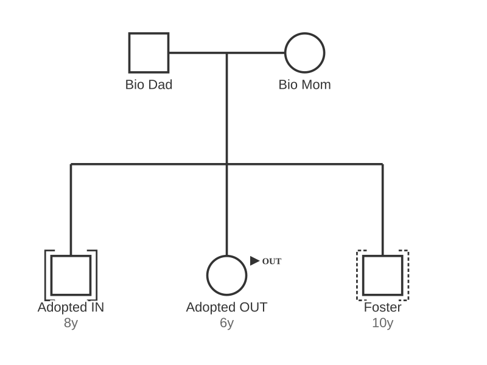

**Features:**
- Adopted IN (brackets inside symbol)
- Adopted OUT (brackets outside symbol)
- Foster care indicator

---

## 5. Birth Order

Siblings ordered by birth sequence.

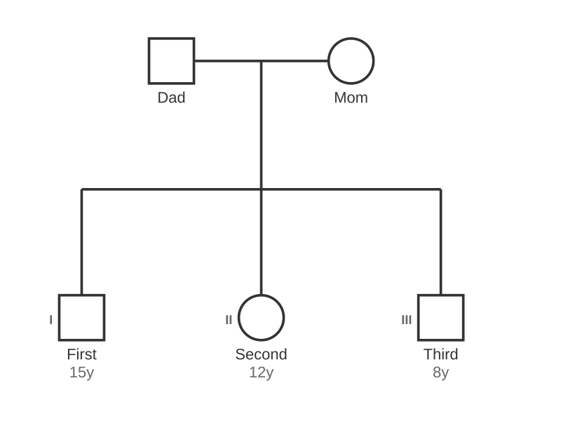

**Features:**
- Left-to-right birth order
- Numbered indicators (1, 2, 3)
- Age labels

---

## 6. Pregnancy Outcomes

Various pregnancy termination and loss types.

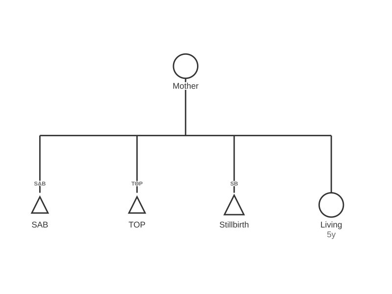

**Features:**
- SAB (Spontaneous Abortion/Miscarriage)
- TOP (Termination of Pregnancy)
- Stillbirth with gestational age
- Living child

---

## 7. Gene Copy Number

Carrier status with genetic copy number variants.

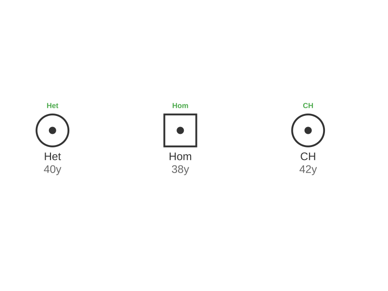

**Features:**
- Heterozygous (Het)
- Homozygous (Hom)
- Compound Heterozygous (CH)
- Carrier dot indicator

---

## 8. Relationship Types

Married vs unmarried partnerships.

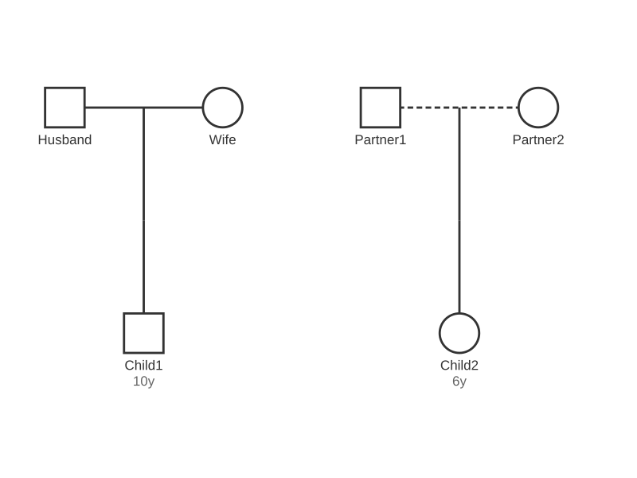

**Features:**
- Solid line (married)
- Dashed line (unmarried)
- Two separate families
- Proper partnership line notation

---

## 9. Special Indicators

Additional clinical and ancestry markers.

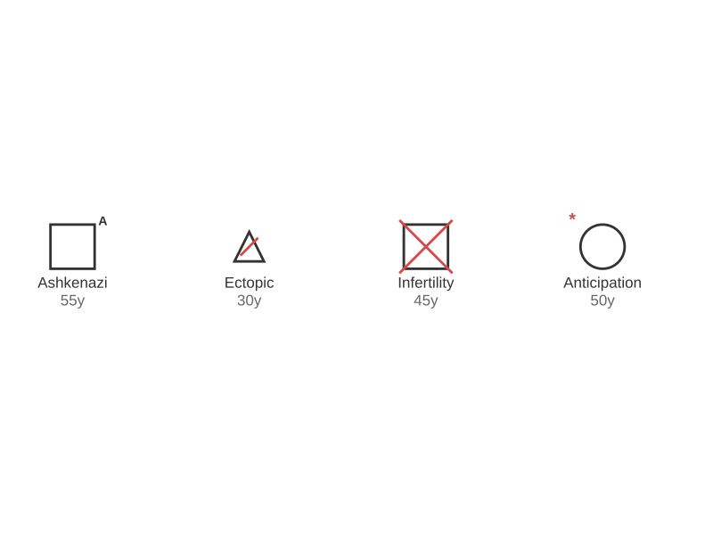

**Features:**
- Ashkenazi Jewish ancestry
- Ectopic pregnancy
- Infertility
- Genetic anticipation

---

## 10. Carrier Types

Different carrier status representations.

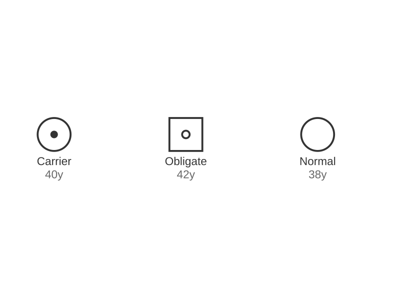

**Features:**
- Carrier (dot in center)
- Obligate carrier (dot in center with label)
- Possible carrier (question mark)

---

## 11. Twins

Monozygotic and dizygotic twin representations.

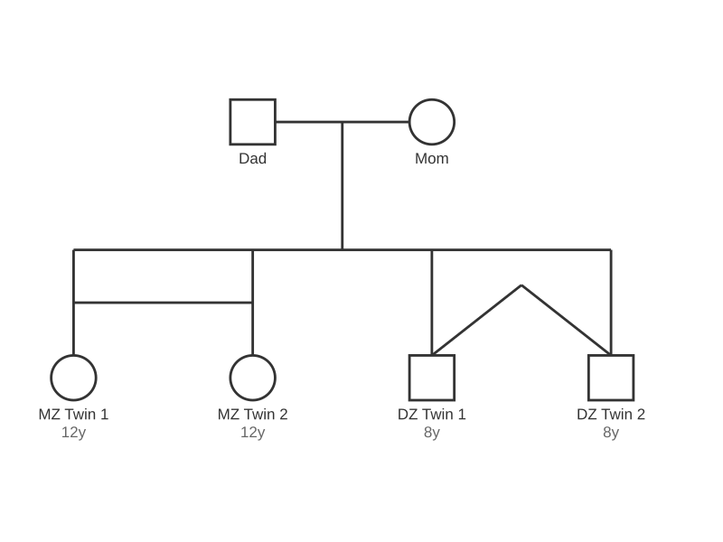

**Features:**
- MZ twins (horizontal bar connection)
- DZ twins (diagonal line connections)
- Proper twin bar geometry

---

## 12. Consanguinity

Related parents (cousin marriage).

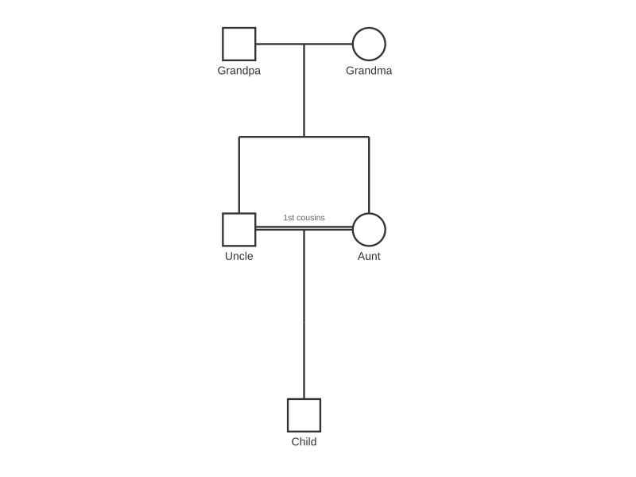

**Features:**
- Double horizontal partnership line
- Cousin relationship indicator
- Proper line spacing (3-5px)

---

## 13. Proband & Consultand

Index case and evaluation subject markers.

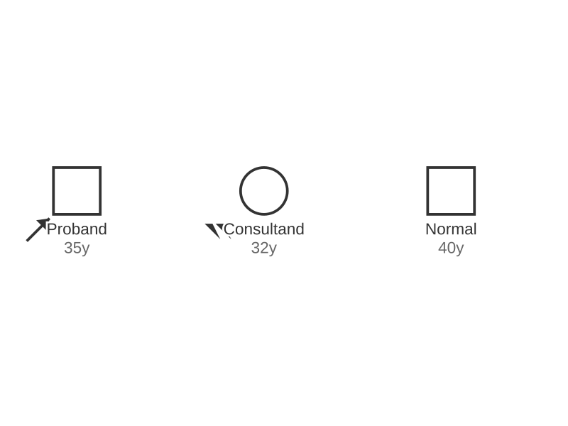

**Features:**
- Proband (arrow pointing to individual)
- Consultand (arrow with "P")
- Proper arrow placement

---

## 14. Deceased

Deceased individuals with age at death.

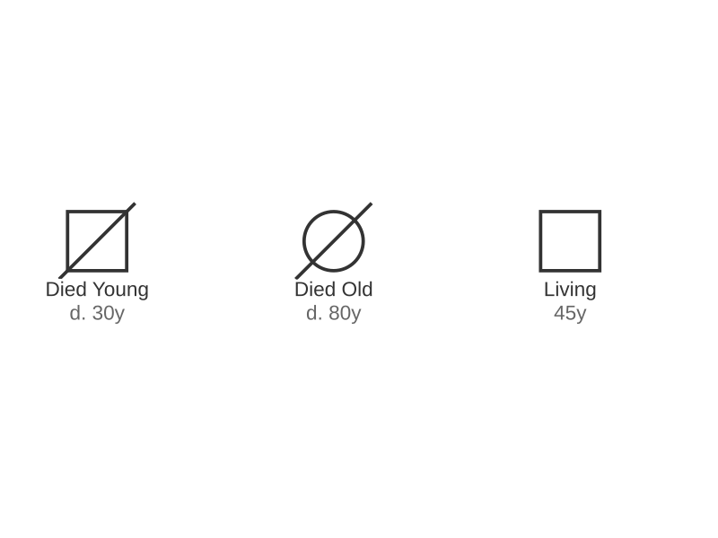

**Features:**
- Diagonal line through symbol
- Age at death (d. XX)
- Multiple deceased markers

---

## 15. Pregnancy Duration

Gestational age for pregnancy losses.

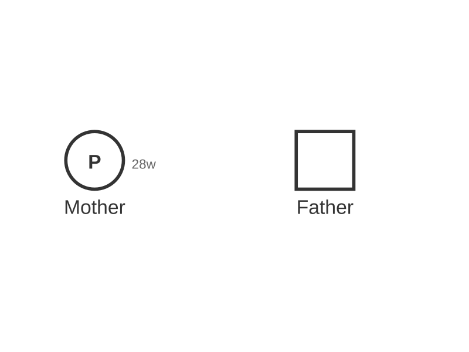

**Features:**
- Gestational age labels
- Different trimester losses
- Pregnancy outcome types

---

## 16. Stillbirth vs Early Loss

Size differentiation for pregnancy losses.

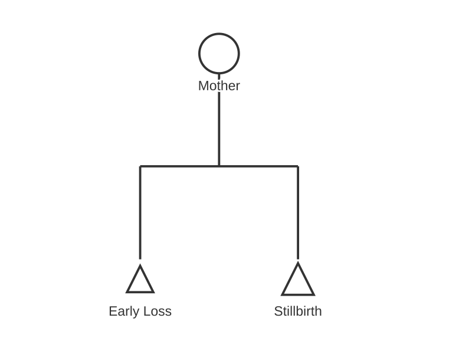

**Features:**
- Larger triangle for stillbirth (>20 weeks)
- Smaller triangle for early loss (<20 weeks)
- Gestational age indicators

---

## 17. No Children by Choice

Childless by choice indicator.

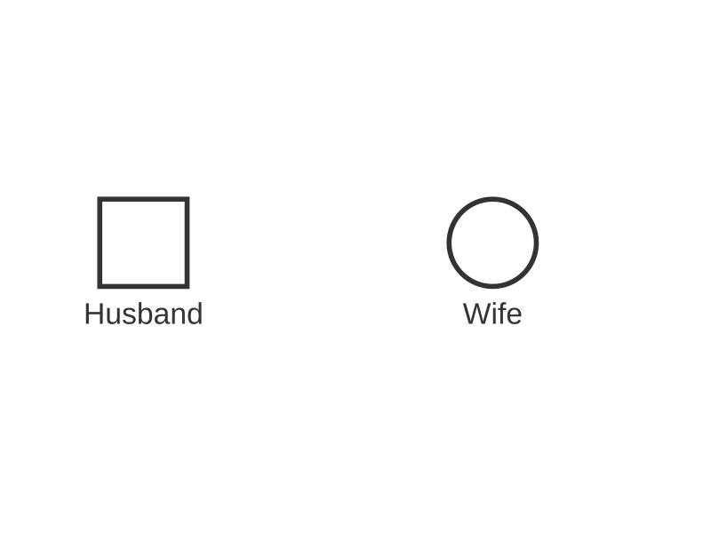

**Features:**
- Double slash through partnership line
- Voluntary childlessness notation
- Partnership without children

---

## 18. Divorced

Divorced couples with hash marks.

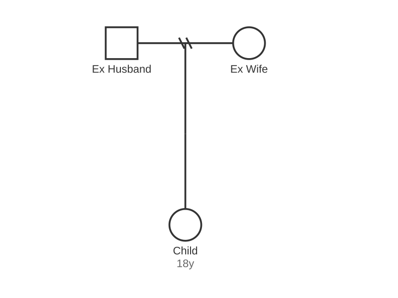

**Features:**
- Double hash marks through partnership line
- Children from divorced parents
- Proper hash mark placement

---

## 19. Conditions

Multiple affected individuals with condition legend.

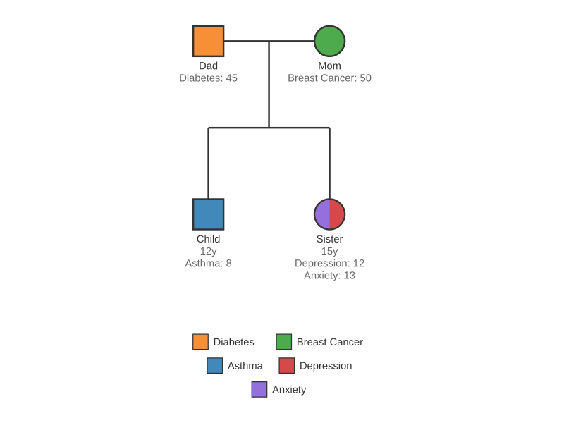

**Features:**
- Colored symbols for different conditions
- Automatic legend generation
- Multiple conditions per individual

---

## 20. Gene Tests

Genetic testing status indicators.

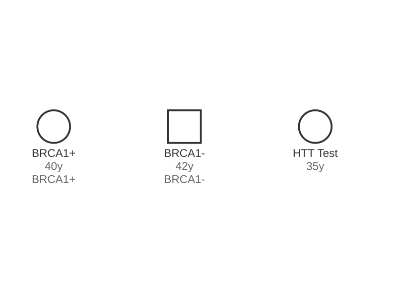

**Features:**
- "+" for positive test result
- "-" for negative test result
- Gene name labels (e.g., BRCA1+)

---

## 21. Complex Pedigree

Comprehensive five-generation pedigree with multiple features.

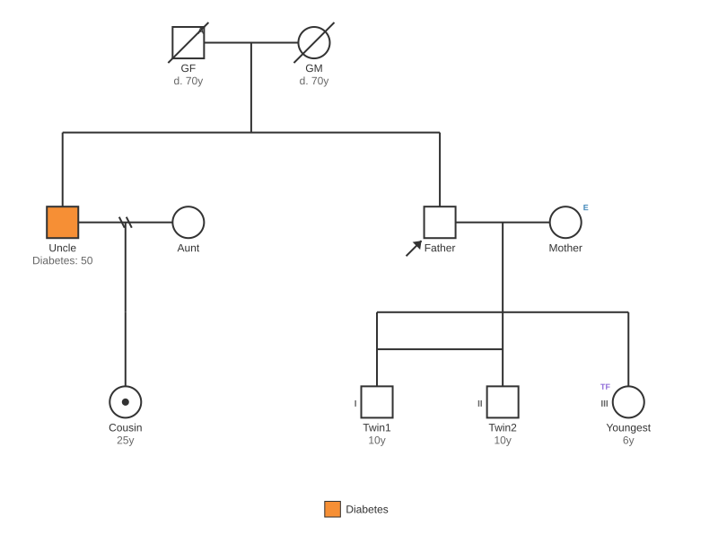

**Features:**
- 5 generations with 36 individuals
- Serial marriages (Father with Mother1 and Mother2)
- MZ and DZ twins
- Multiple conditions (Heart Disease, Diabetes, Breast Cancer, Asthma, Depression)
- Adoption, ART (egg donor), deceased members
- Gene testing (BRCA1+)
- Carrier status, proband/consultand markers
- Proper alignment of second partnership above children (0.0px misalignment)

---

## CI/CD Integration

These examples are automatically generated on every commit via GitHub Actions:

1. `examples/generate-all-scenarios.ts` creates all 21 PNG files
2. Images are committed back to `examples/output/`
3. This document displays the latest generated images

To regenerate locally:
```bash
npm run examples
```

---

## Standards Compliance

All diagrams comply with:
- **Bennett et al. 2008**: "Standardized human pedigree nomenclature"
- **Bennett et al. 2022**: "Standardized pedigree nomenclature update centered on sex and gender inclusivity"

Published by the National Society of Genetic Counselors (NSGC).
