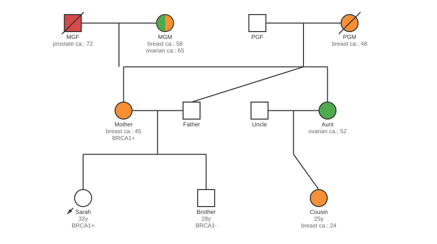

# Pedigree MCP Server

<p align="center">
  
</p>

<p align="center">
  <a href="https://github.com/zzgael/pedigree-mcp/actions/workflows/ci.yml"></a>
  <a href="https://www.npmjs.com/package/pedigree-mcp"></a>
  <a href="https://www.npmjs.com/package/pedigree-mcp"></a>
  <a href="https://github.com/zzgael/pedigree-mcp/blob/main/LICENSE"></a>
  <a href="https://pubmed.ncbi.nlm.nih.gov/18792771/"></a>
</p>

<p align="center">
  An MCP (Model Context Protocol) server for generating family pedigree tree diagrams as PNG images using standard genetic notation per <a href="https://onlinelibrary.wiley.com/doi/full/10.1007/s10897-008-9169-9">Bennett 2008 NSGC guidelines</a>.
</p>

<p align="center">
  
</p>

## Installation

### Prerequisites
- Node.js 18+
- npm or pnpm

### Build from Source

```bash
# Clone and navigate to the directory
cd pedigree-mcp

# Install dependencies
npm install

# Build the project
npm run build
```

### MCP Client Configuration

Add to your MCP client configuration (e.g., Claude Desktop, GPT Workbench):

**Using stdio transport:**
```json
{
  "mcpServers": {
    "pedigree": {
      "command": "node",
      "args": ["/path/to/pedigree-mcp/dist/index.js"],
      "env": {}
    }
  }
}
```

**Using npx (if published to npm):**
```json
{
  "mcpServers": {
    "pedigree": {
      "command": "npx",
      "args": ["pedigree-mcp"],
      "env": {}
    }
  }
}
```

## Features

### Bennett 2008 Standard Compliance

This implementation follows the [NSGC Standardized Human Pedigree Nomenclature](https://pubmed.ncbi.nlm.nih.gov/18792771/):

| Symbol | Description | Property |
|--------|-------------|----------|
| Square | Male | `sex: "M"` |
| Circle | Female | `sex: "F"` |
| Diamond | Unknown sex | `sex: "U"` |
| Filled shape | Affected individual | `conditions: [...]` |
| Diagonal line | Deceased | `status: 1` |
| Arrow (lower-left) | Proband | `proband: true` |
| Double arrow (lower-left) | Consultand (person seeking counseling) | `consultand: true` |
| Brackets [ ] | Adopted | `noparents: true` |
| Double line | Consanguinity | Auto-detected from shared ancestors |
| Text on double line | Consanguinity degree | `consanguinity_degree: "1st cousins"` |
| Horizontal bar | MZ (identical) twins | `mztwin: "group_id"` |
| Diagonal lines | DZ (fraternal) twins | `dztwin: "group_id"` |
| Dot in center | Carrier status | `carrier: true` |
| Outlined dot | Obligate carrier (inferred) | `obligate_carrier: true` |
| "P" inside symbol | Pregnancy | `pregnant: true` |
| "P" + weeks label | Pregnancy duration | `pregnant: true, terminated_age: 12` |
| Small triangle | Early pregnancy loss (<20 weeks) | `terminated: true, terminated_age: 8` |
| Large triangle | Stillbirth (≥20 weeks) | `terminated: true, terminated_age: 24` |
| "EP" below symbol | Ectopic pregnancy | `ectopic: true` |
| Crossed lines (X) | Infertility | `infertility: true` |
| Hash marks on line | Divorced/separated | `divorced: true` |
| Line through offspring | No children by choice | `no_children_by_choice: true` |
| "A" in upper right | Ashkenazi ancestry | `ashkenazi: 1` |
| "*" in upper left | Genetic anticipation | `anticipation: true` |
| "d. XXy" label | Age at death (auto-calculated) | `yob: 1950, yod: 2020, status: 1` |
| Arrow + "OUT" label | Adopted OUT (placed for adoption) | `adoption_type: "out"` |
| Dashed brackets | Foster placement (temporary) | `adoption_type: "foster"` |
| Roman numerals I, II, III | Birth order in sibling group | `birth_order: 1` (displays as "I") |
| "E" marker (blue) | ART - Egg donor conception | `art_type: "egg_donor"` |
| "S" marker (blue) | ART - Sperm donor conception | `art_type: "sperm_donor"` |
| "Em" marker (blue) | ART - Embryo donor conception | `art_type: "embryo_donor"` |
| "GC" marker (blue) | ART - Gestational carrier (surrogate) | `art_type: "surrogate"` |
| "SAB" label | Pregnancy outcome - Spontaneous abortion | `pregnancy_outcome: "miscarriage"` |
| "TOP" label | Pregnancy outcome - Termination of pregnancy | `pregnancy_outcome: "induced_termination"` |
| "SB" label | Pregnancy outcome - Stillbirth | `pregnancy_outcome: "stillbirth"` |
| "Het" label (green) | Gene copy number - Heterozygous | `gene_copy_number: "heterozygous"` |
| "Hom" label (green) | Gene copy number - Homozygous | `gene_copy_number: "homozygous"` |
| "CH" label (green) | Gene copy number - Compound heterozygous | `gene_copy_number: "compound_heterozygous"` |
| Dashed partnership line | Unmarried/common-law partnership | `relationship_type: "unmarried"` |

### Conditions (Bennett Standard - FREE TEXT)

Per Bennett 2008 standard, conditions are documented using **free text**. Simply provide a `conditions` array with any disease/condition name:

```json
{
  "conditions": [
    { "name": "Breast cancer", "age": 42 },
    { "name": "Ovarian cancer", "age": 55 }
  ]
}
```

**Examples:**
- `{ "name": "Huntington's disease", "age": 45 }`
- `{ "name": "Type 2 diabetes" }` (no age = affected status only)
- `{ "name": "Cystic fibrosis" }`
- `{ "name": "Hereditary hemochromatosis", "age": 38 }`

**Colors are auto-assigned** from a palette based on unique condition names. Multiple conditions show as quadrants (male) or pie slices (female).

### Genetic Testing Results

Supports **any gene** - use pattern `{gene}_gene_test`:

```json
{
  "brca1_gene_test": { "type": "T", "result": "P" },
  "htt_gene_test": { "type": "T", "result": "P" },
  "apoe_gene_test": { "type": "S", "result": "N" }
}
```

Gene test result codes:
- **type**: `T` (tested), `S` (screening), `-` (unknown)
- **result**: `P` (positive), `N` (negative), `-` (unknown/VUS)

Labels appear as: `BRCA1+` (positive), `HTT-` (negative)

## Tools

### `get_pedigree_documentation`

Returns comprehensive documentation about the pedigree data format. **Always call this first** before generating a pedigree.

### `generate_pedigree`

Generates a PNG image of a family pedigree tree.

**Parameters:**
| Parameter | Type | Default | Description |
|-----------|------|---------|-------------|
| `dataset` | `Individual[]` | required | Array of family members |
| `width` | `number` | 800 | Image width in pixels |
| `height` | `number` | 600 | Image height in pixels |
| `symbol_size` | `number` | 35 | Node diameter in pixels |
| `background` | `string` | #ffffff | Background color |
| `labels` | `string[]` | ['age'] | Attributes to display |

## Data Format

### Individual Object

```typescript
interface Individual {
  // Required
  name: string;           // Unique ID (max 7 chars)
  sex: "M" | "F" | "U";   // Male, Female, Unknown

  // Identity
  display_name?: string;  // Human-readable name for display (max 13 chars)
  top_level?: boolean;    // Founding individual (no parents)
  proband?: boolean;      // Index case

  // Relationships
  mother?: string;        // Mother's name (must exist in dataset)
  father?: string;        // Father's name (must exist in dataset)

  // Demographics
  age?: number;           // Current age
  yob?: number;           // Year of birth
  status?: number;        // 0 = alive, 1 = deceased

  // Twins (Bennett standard)
  mztwin?: string;        // MZ twin group ID (identical)
  dztwin?: string;        // DZ twin group ID (fraternal)

  // Special indicators (Bennett standard)
  carrier?: boolean;      // Carrier status (dot in center)
  pregnant?: boolean;     // Current pregnancy (P inside symbol)
  terminated?: boolean;   // Stillbirth/SAB (small triangle)
  divorced?: boolean;     // Divorced from partner (hash marks)
  noparents?: boolean;    // Adopted (brackets around symbol)

  // Conditions (Bennett standard - FREE TEXT)
  conditions?: Array<{
    name: string;         // Any condition: "Breast cancer", "Huntington's disease", etc.
    age?: number;         // Age at diagnosis/onset
  }>;

  // Genetic tests (pattern: {gene}_gene_test)
  brca1_gene_test?: { type: "-"|"S"|"T", result: "-"|"P"|"N" };
  brca2_gene_test?: { type: "-"|"S"|"T", result: "-"|"P"|"N" };
  // ... any gene test
}
```

## Examples

### Basic Three-Generation Pedigree

```json
[
  {"name": "MGF", "sex": "M", "top_level": true},
  {"name": "MGM", "sex": "F", "top_level": true, "conditions": [{"name": "Breast cancer", "age": 55}]},
  {"name": "Mother", "sex": "F", "mother": "MGM", "father": "MGF", "conditions": [{"name": "Breast cancer", "age": 42}]},
  {"name": "Father", "sex": "M", "top_level": true},
  {"name": "Proband", "display_name": "Sarah", "sex": "F", "mother": "Mother", "father": "Father", "proband": true, "age": 25, "brca1_gene_test": {"type": "T", "result": "P"}}
]
```

### Neurological Condition Pedigree

```json
[
  {"name": "GF", "sex": "M", "top_level": true, "status": 1, "conditions": [{"name": "Huntington's disease", "age": 52}]},
  {"name": "GM", "sex": "F", "top_level": true},
  {"name": "Father", "sex": "M", "mother": "GM", "father": "GF", "conditions": [{"name": "Huntington's disease", "age": 48}]},
  {"name": "Mother", "sex": "F", "top_level": true},
  {"name": "Proband", "sex": "M", "mother": "Mother", "father": "Father", "proband": true, "age": 25, "carrier": true}
]
```

### Twins Example

```json
[
  {"name": "Dad", "sex": "M", "top_level": true},
  {"name": "Mom", "sex": "F", "top_level": true},
  {"name": "Twin1", "sex": "M", "mother": "Mom", "father": "Dad", "mztwin": "mz1"},
  {"name": "Twin2", "sex": "M", "mother": "Mom", "father": "Dad", "mztwin": "mz1"},
  {"name": "DZTwin1", "sex": "M", "mother": "Mom", "father": "Dad", "dztwin": "dz1"},
  {"name": "DZTwin2", "sex": "F", "mother": "Mom", "father": "Dad", "dztwin": "dz1"}
]
```

### Complex Family with Bennett Features

```json
[
  {"name": "GF", "sex": "M", "top_level": true, "status": 1},
  {"name": "GM", "sex": "F", "top_level": true, "carrier": true},
  {"name": "Father", "sex": "M", "mother": "GM", "father": "GF", "divorced": true},
  {"name": "Mother", "sex": "F", "top_level": true},
  {"name": "Child1", "sex": "F", "mother": "Mother", "father": "Father", "proband": true, "noparents": true},
  {"name": "Loss", "sex": "U", "mother": "Mother", "father": "Father", "terminated": true}
]
```

## Development

```bash
# Install dependencies
npm install

# Run in development mode (watch)
npm run dev

# Run all tests
npm test

# Build for production
npm run build

# Type check
npx tsc --noEmit
```

## Testing

- **87 tests total** covering:
  - Validation (parent references, gender constraints)
  - SVG rendering (all symbol types, indicators)
  - Condition markers and multi-condition pie charts
  - Gene test formatting
  - Twin rendering (MZ with bar, DZ without)
  - Consanguinity detection
  - Bennett 2008 compliance (carrier, pregnancy, termination, divorced)
  - Edge cases (deep pedigrees, wide generations, half-siblings)

## References

- [Bennett et al. 2008 - Standardized Human Pedigree Nomenclature](https://pubmed.ncbi.nlm.nih.gov/18792771/)
- [Bennett et al. 2022 - Sex and Gender Inclusivity Update](https://pubmed.ncbi.nlm.nih.gov/36106433/)
- [Iowa Human Genetics - How to Draw a Pedigree](https://humangenetics.medicine.uiowa.edu/resources/how-draw-pedigree)

## License

MIT License - see [LICENSE](LICENSE)
